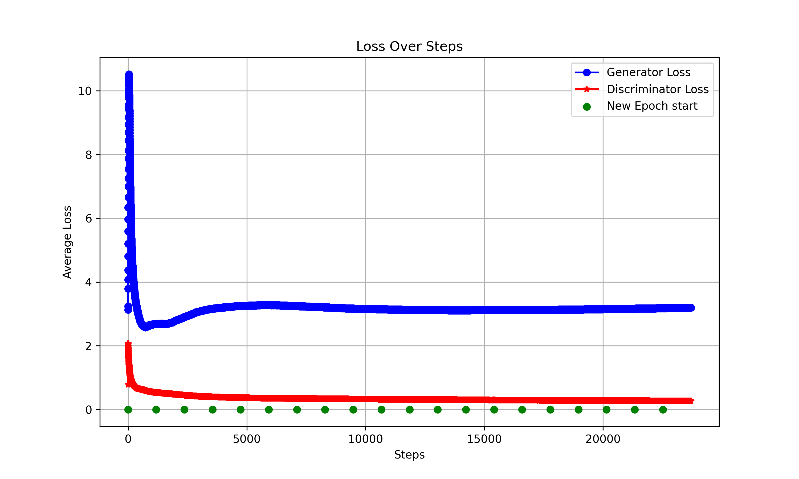

# Implementing a GAN (Generative Adveserial Network) using the following resoruces 

## Generative Adversarial Networks
- Ian J. Goodfellow, Jean Pouget-Abadie, Mehdi Mirza, Bing Xu, David Warde-Farley, Sherjil Ozair, Aaron Courville, Yoshua Bengio

**Paper** - https://arxiv.org/pdf/1406.2661

*Source code* - https://github.com/goodfeli/adversarial

-------
## UNSUPERVISED REPRESENTATION LEARNING WITH DEEP CONVOLUTIONAL GENERATIVE ADVERSARIAL NETWORKS (DCGAN)

**Paper** - https://arxiv.org/pdf/1511.06434
- Alec Radford, Luke Metz, Soumith Chintala

-----
## NIPS 2016 Tutorial: Generative Adversarial Networks
**Paper** - https://arxiv.org/pdf/1701.00160
- Ian Goodfellow

**EXTRAS**
- https://github.com/soumith/ganhacks
- https://in.mathworks.com/help/deeplearning/ug/monitor-gan-training-progress-and-identify-common-failure-modes.html#mw_f7532f53-e5a3-405b-9fa6-e56dc6e6304f

# RESULTS

Trained a GAN for 20 epochs on a sub-set of the LSUN bedroom dataset (around 300k images). Here is a per epoch evolution of generations over a fixed sample of random  noise.

Here is the loss plot!

# Hyperparameters

- Z dimension (noise/latent space) : 128
- learning rate: 0.0002 
- Optimizer used: ADAM 
   - Beta1: 0.5
   - Beta2: 0.999
- Generator filters: 1024
- Discriminator filters: 512

**Model Weights**: https://drive.google.com/file/d/1SbUywCkZmFpOmYb-SfBHpCLCFUl5Dq-u/view?usp=drive_link

*Have a Nice day!*